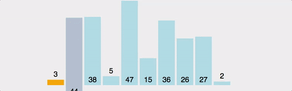

# 정렬 알고리즘

<!-- https://velog.io/@kku64r/sort -->

## 삽입 정렬 (Insertion Sort)



- k번째 원소를 첫 번째부터 k-1번째 원소까지 비교하여, 적절한 위치에 배치하고 그 뒤의 원소들을 한 칸씩 뒤로 밀어내는 방식
- 시간 복잡도 - 평균: O(n^2), 최악: O(n^2)

```java
void insertionSort(int[] arr) {
  for (int i = 1; i < arr.length; i++) {
    int tmp = arr[i]; // k번째 원소
    int j = i - 1; // 비교할 원소의 인덱스

    // 비교하는 원소가 k번째 원소보다 큰 경우, 뒤로 원소를 한 칸 미룸
    while (j >= 0 && tmp < arr[j]) {
      arr[j + 1] = arr[j];
      j--;
    }
    
    // 모든 연산이 완료되면 k번째 원소를 배치
    arr[j + 1] = tmp;
 }
}
```