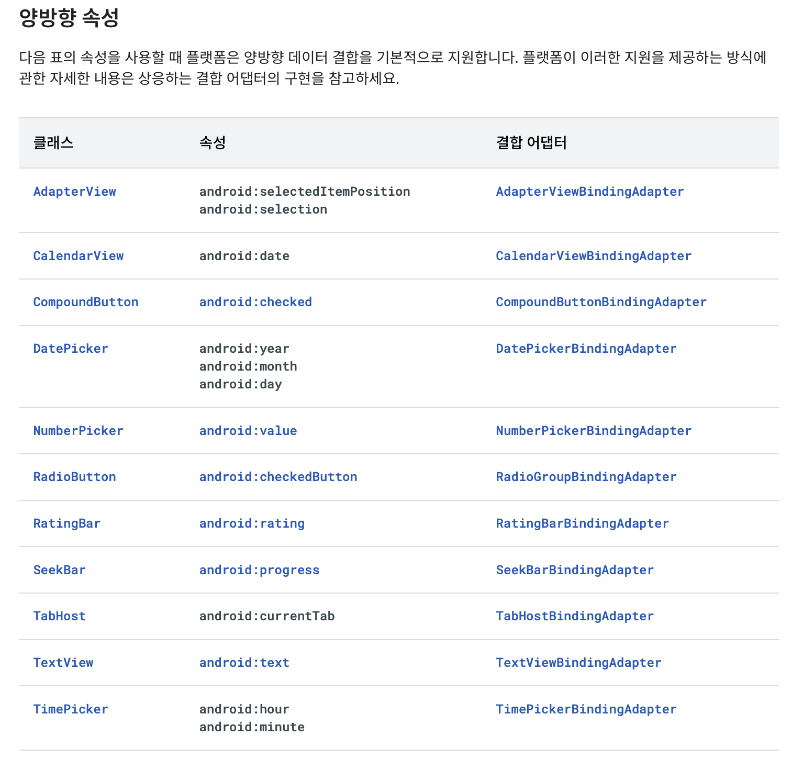
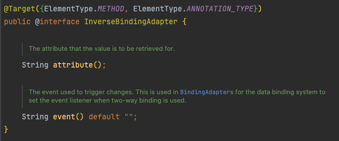

# 양방향 데이터 바인딩 적용하기
## 양방향 데이터 바인딩 (Two-way binding)
```xml
<CheckBox
    android:id="@+id/checkBox"
    android:checked="@={viewmodel.isChecked}"
    ... />
```
- 해당 변수로 속성 값을 설정하는 동시에, 속성의 변경 값을 해당 변수에 저장하겠다는 의미
  - 기존의 바인딩은 `Model -> View`로 데이터가 흘러가는 형식이었다면, 양방향은 `Model -> View`, `View -> Model` 모두 지원
- `@={}`로 표현

## 지원 사항
- [Android Developer](https://developer.android.com/topic/libraries/data-binding/two-way?hl=ko#two-way-attributes) 참고



## 커스텀하기
현재 선택한 탭을 양방향 데이터 바인딩으로 연결하고자 했으나 기본 지원에 없음...  
API 30 이후로 Deprecated된 `TabHost`까지만 지원하고, `TabLayout`은 양방향 데이터 바인딩을 지원하고 있지 않았음  
그래서.. 다음 예제에서는 현재 선택한 탭을 양방향 데이터 바인딩으로 연결하는 예제를 구현함

### BindingAdapters.kt
- 정의해야 할 것: Setter(Model -> View), Getter(View -> Model), 언제 Getter를 호출할 지
  - 각각 `BindingAdapter`, `InverseBindingAdapter`, `InverseBindingListener`로 대응됨
```kotlin
// BindingAdapter(Model -> View), 세터의 역할
@BindingAdapter("app:selectedTabPosition")
fun TabLayout.setSelectedTabPosition(position: Int) {
    if (selectedTabPosition != position) {
        getTabAt(position)?.select()
    }
}

// InverseBindingAdapter(View -> Model), 게터의 역할
// attribute는 기존에 정의한 앞서 정의한 BindingAdapter의 value와 동일하게 작성하면 됨
@InverseBindingAdapter(attribute = "app:selectedTabPosition")
fun TabLayout.getSelectedTabPosition(): Int = this.selectedTabPosition

// InverseBindingAdapter(View -> Model)
// Model로 데이터를 전달하는 기준을 정의함, 예제에서는 탭의 selected가 변경될 때마다 Model의 값이 변경하게 됨
// value로 위에서 정의한 attribute의 이름에 AttrChanged 붙인 값을 넘겨주어야 함 (자세한 내용은 아래에서)
@BindingAdapter("app:selectedTabPositionAttrChanged")
fun TabLayout.setTabPositionAttrChanged(onTabPositionAttrChange: InverseBindingListener) {
    addOnTabSelectedListener(object : OnTabSelectedListener {
        override fun onTabSelected(p0: TabLayout.Tab?) {
            onTabPositionAttrChange.onChange()
        }

        override fun onTabUnselected(p0: TabLayout.Tab?) {
        }

        override fun onTabReselected(p0: TabLayout.Tab?) {
        }
    })
}
```
#### @InverseBindingAdapter
  

- `attribute`: 기존 바인딩 어댑터와 동일하게, 바인딩 어댑터의 이름을 지정하는 변수
  - 바인딩 어댑터의 이름과 동일하게 선언하자 
- `event`: 데이터가 변경되었음을 알려주는 변수, event로 전달된 함수(`onChange()` 함수가 불린 때)에 따라 값을 반환
  - 미설정 시, attribute명에 `AttrChanged`를 더한 이름으로 자동 설정됨, 커스텀이 필요하면 직접 선언하자
  - ex) attribute = "tabPosition" -> event = "tabPositionAttrChanged"

### HomeViewModel.kt
```kotlin
class HomeViewModel : ViewModel() {
    val selectedTabPosition = MutableStateFlow(0)
}
```

### fragment_home.xml
```xml
<?xml version="1.0" encoding="utf-8"?>
<layout xmlns:android="http://schemas.android.com/apk/res/android"
  xmlns:app="http://schemas.android.com/apk/res-auto">

  <data>
    <variable
      name="vm"
      type="com.example.databinding.HomeViewModel" />
  </data>

  <LinearLayout
    android:orientation="vertical"
    android:layout_width="match_parent"
    android:layout_height="match_parent">

    <com.google.android.material.tabs.TabLayout
      android:id="@+id/tabLayout"
      android:layout_width="match_parent"
      android:layout_height="wrap_content"
      app:selectedTabPosition="@={vm.selectedTabPosition}">

      ...
    </com.google.android.material.tabs.TabLayout>
    
    ...
  </LinearLayout>
</layout>
```

끗!

## 참고
- [양방향 데이터 결합 | Android Developer](https://developer.android.com/topic/libraries/data-binding/two-way?hl=ko)
- [데이터바인딩 two-way binding 원리](https://improve777.medium.com/데이터바인딩-two-way-binding-원리-4317396728ff)
- [\[Android\] DataBinding #4 - InverseBindingAdapter + Two-way Binding](https://jaejong.tistory.com/99)
