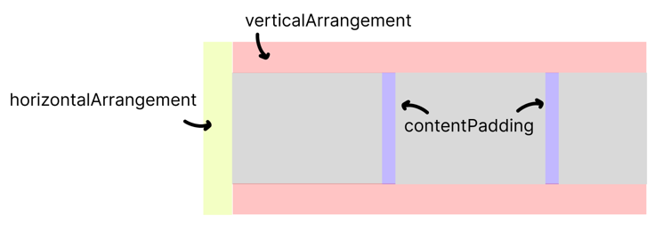

## [04. Basic Layouts Codelab](https://developer.android.com/codelabs/jetpack-compose-layouts?hl=ko&continue=https%3A%2F%2Fdeveloper.android.com%2Fcourses%2Fpathways%2Fjetpack-compose-for-android-developers-1%3Fhl%3Dko%23codelab-https%3A%2F%2Fdeveloper.android.com%2Fcodelabs%2Fjetpack-compose-layouts#0) 

### 최소, 최대 크기 설정
- `heightIn`, `widthIn`: 세로, 가로 크기의 최소, 최대 값을 설정하는 속성
```kotlin
Box(
    modifier = Modifier
        .heightIn(max = 200.dp)
        .widthIn(min = 100.dp, max = 200.dp)
) { ... }
```

### baseline에 맞춰 padding 설정
- baseline 정의

- `paddingFromBaseline`: baseline에 맞춰 padding을 적용하는 속성
```kotlin
Text("text", modifier = Modifer.paddingFromBaseline(all = 8.dp))
```

### 슬롯 기반 레이아웃
- Slot API: 모든 컴포넌트를 구현하는 대신, 람다로 받은 Composable 함수를 통해 전체 컴포넌트를 구현하는 방식
  - 재사용성과 유연성을 위함
  - Scaffold 등 우리가 사용하는 대부분 Composable이 이러한 Slot 형태로 구현되어 있음
```kotlin
@Composable
fun HomeSection(
  title: String, 
  content: @Composable () -> Unit,
) {
    Column {
        Text(text = title, style = ...)
        // 직접 내부를 구현하지 않았기 때문에 유연성이 높다!
        content() 
    }
}
```

### 스크롤 구현
- `verticalScroll`, `horizontalScroll`: 각각 세로, 가로 스크롤을 지원하는 속성
- `scrollState`를 통해 스크롤의 위치를 변경하거나 현재 상태를 조회할 수 있음
```kotlin
Column(Modifier.verticalScroll(rememberScrollState())) { ... }
```

### LazyLayout padding
- `contentPadding`: 아이템 간 간격을 조정하는 속성  
- `Arrangement.spacedBy`: 부모의 상하좌우 공간을 조정하는 속성
  - 패딩 ㄴㄴ, 스크롤이 끝났을 때 남은 공간을 정의하는 속성
```kotlin
LazyRow(
    contentPadding = PaddingValues(8.dp),
    horizontalArrangement = Arrangement.spacedBy(16.dp),
    verticalArrangement = Arrangement.spacedBy(16.dp),
    ...
) { ... }
```
