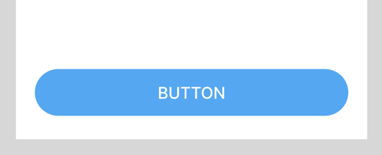

# FloatingWidget 만들기 (Stack & Positioned)



- fab 버튼처럼 특정 위젯을 다른 곳에 띄우고 싶다면 `Stack`과 `Positioned` 위젯을 활용하면 됨

```dart
Stack(
  children: [
    ...
    Positioned(
      bottom: 32,
      child: ... 
    )
  ]
)
```

## Stack
- 위젯을 겹치게 할 때 사용하는 위젯

## Positioned
- Stack 내부에서만 동작하는 위젯으로, Stack 내부에서 위치를 고정하는데에 사용되는 위젯
- `left`, `right`, `top`, `bottom` 값으로 고정되는 위치를 설정할 수 있음
  - `top`, `bottom` 속성을 null 값으로 지정하면 상단으로 고정됨
  - null이 아닌 값을 넣어주면 해당 방향으로 위젯이 스티키되며, 넣어 준 값만큼 마진이 적용됨
