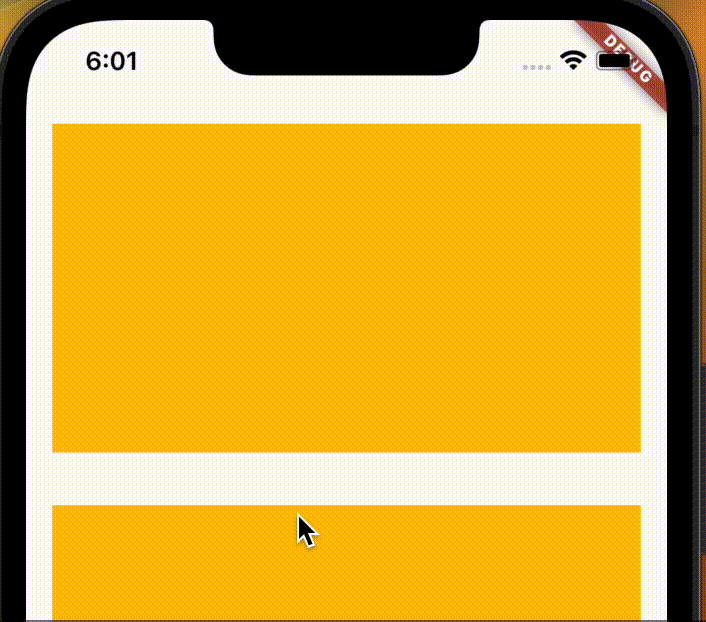
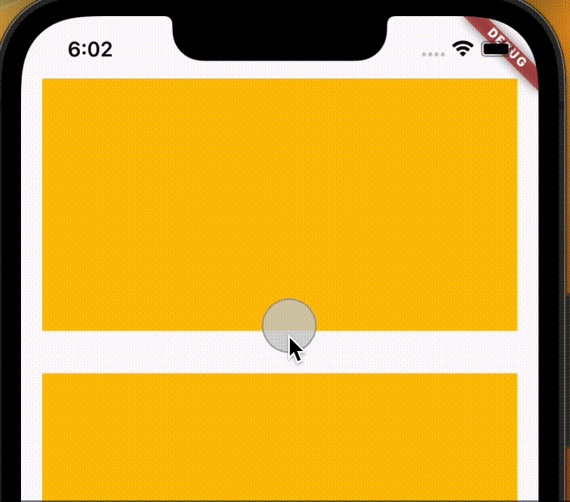

# ScrollView의 오버 스크롤 애니메이션 제거하기



<br/>

- Flutter에서 `SingleChildView`를 비롯한 스크롤뷰 사용 시, 자동으로 오버 스크롤이 적용됨
- 이를 막기 위해서는 `physics` 속성을 `ClampingScrollPhysics`으로 변경해주면 됨

```dart
SingleChildScrollView(
  physics: ClampingScrollPhysics(),
  scrollDirection: Axis.verical,
  child: ...
)
```
```dart
TabBar(
  isScrollable: true,
  physics: ClampingScrollPhysics(),
)
```

<br/>



잘 된다~