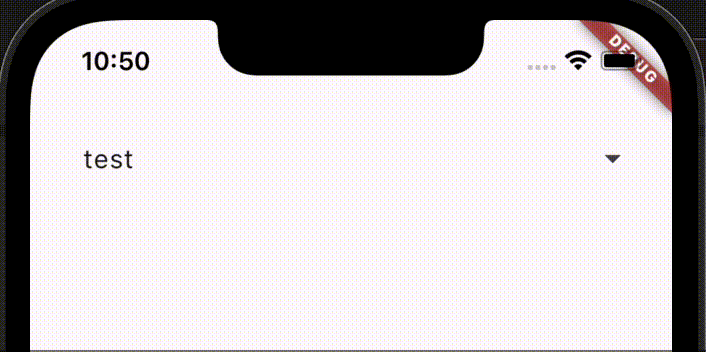
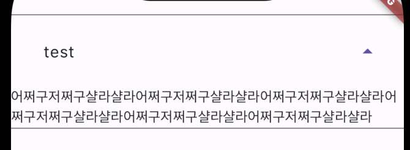

## [ExpansionTile](https://api.flutter.dev/flutter/material/ExpansionTile-class.html)
- 확장 및 축소를 지원하는 타일

### 사용법
```dart
class SampleExpansionTile extends StatefulWidget {
  const SampleExpansionTile({super.key});

  @override
  State<SampleExpansionTile> createState() => _SampleExpansionTileState();
}

class _SampleExpansionTileState extends State<SampleExpansionTile> {
  bool _expanded = false;

  @override
  Widget build(BuildContext context) {
    return ExpansionTile(
      title: const ListTile(title: Text('test')),
      trailing: Icon(_expanded ? Icons.arrow_drop_up : Icons.arrow_drop_down),
      onExpansionChanged: (exapanded) {
        setState(() {
          _expanded = exapanded;
        });
      },
      children: const [
        Text('어쩌구저쩌구샬라샬라어쩌구저쩌구샬라샬라어쩌구저쩌구샬라샬라어쩌구저쩌구샬라샬라어쩌구저쩌구샬라샬라어쩌구저쩌구샬라샬라'),
      ],
    );
  }
}
```




### Expande 됐을 때 노출되는 Border 삭제하기




- `Theme`의 `divderColor`를 변경해주어야 함, border 있는 게 디폴트인듯  
```dart
Theme(
  data: ThemeData().copyWith(dividerColor: Colors.transparent),
  child: ExpansionTile(..)
)
```
- 커스텀한 Theme을 사용할 경우에는 context를 통해 현재 Theme 가져와서 사용
```dart
Theme(
  data: Theme.of(context).copyWith(dividerColor: Colors.transparent)
  child: ExpansionTile(..)
)
```

### 클릭 애니메이션 삭제
- Theme 설정을 통해 삭제해야 함
  - `splashColor`: 클릭했을 때 퍼져나가는(...) 애니메이션의 색상
  - `highlightColor`: 클릭했을 때 background 색상
```dart
Theme(
  data: ThemeData(
    splashColor: Colors.transparent,
    highlightColor: Colors.transparent,
  ),
  child: ExpansionTile(...)
)
```