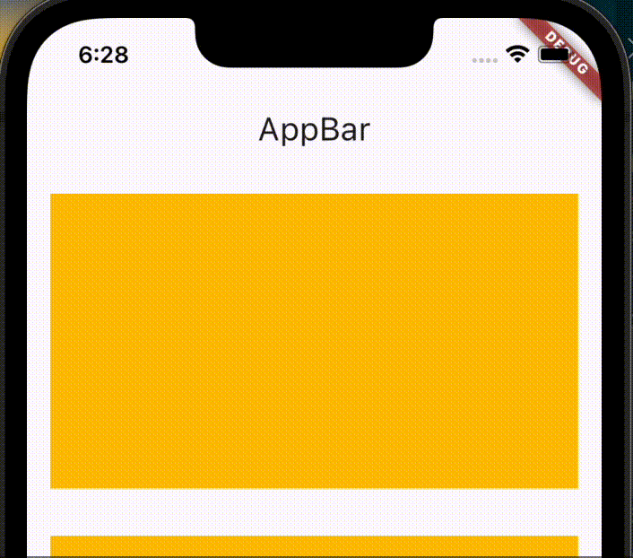

# 스크롤했을 때, AppBar의 Background Color가 변경되는 이슈

- 스크롤 시 AppBar의 Background Color가 변경되는 이슈가 있음



## 해결방안1: surfaceTintColor
```dart
AppBar(
  surfaceTintColor: Colors.white,
  title: const Text('AppBar'),
),
```

## 해결방안2: scrollUnderElevation
- 위 방법이 먹히지 않으면 해당 방법을 적용해보자
```dart
AppBar(
  scrollUnderElevation: 0,
  title: const Text('AppBar'),
),
```