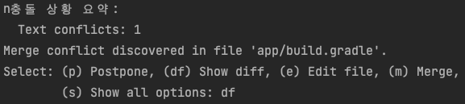

# SVN

## 프로젝트 checkout
- 해당 root 폴더를 포함하여 다운받으니 그 점 유의하기
  - 예를 들어, abc/AbcProject의 repository를 checkout하면 AbcProject 폴더가 자동 생성됨, 고로 따로 빈 폴더를 생성할 필요없다~
```
svn checkout --username [user name] --password [password] [repository url]
```
- 이미 username과 password 정보가 입력되어 있다면 repository url만 작성하면 됨
```
svn checkout [repository url]
```

## pull 받기: update
```
svn up(date)
```

## 로그 출력하기: log
- 모든 로그 출력: 해당 레포지토리의 모든 로그를 한 번에 출력하는 명령어라 매우 느림, 웬만하면 출력 개수를 제한하는 아래 방식을 사용하도록 하자
```
svn log
```
- 출력 개수를 제한하여 로그 출력하기 (`-l`)
```
svn log -l [count]
```
- 해당 리비전(커밋)의 변경된 파일 목록 확인하기
  - `-r [--revision]`: 특정 리비전을 선택할 때 사용하는 옵션
  - `-v`: 변경된 디렉토리/파일을 보여주는 옵션
```
svn log -r [revision number] -v
```

## 충돌 해결하기
- 업데이트를 받다 보면 충돌이 나는 경우가 있음, 아래의 순서대로 충돌을 해결하면 됨

1. 충돌 확인하기



2. (df)를 통해 충돌난 코드를 확인하고 (p)를 통해 머지 연기하기
3. 충돌난 파일에서 충돌한 코드 직접 수정하기
4. 충돌난 파일 우클릭해서 Subversion > Mark Resolved 클릭
5. 수정한 파일 선택 후 Resolve 해주면 끝~

- 참고로 `Resolve Text Conflict`를 통해 머지하는 방법도 있음
